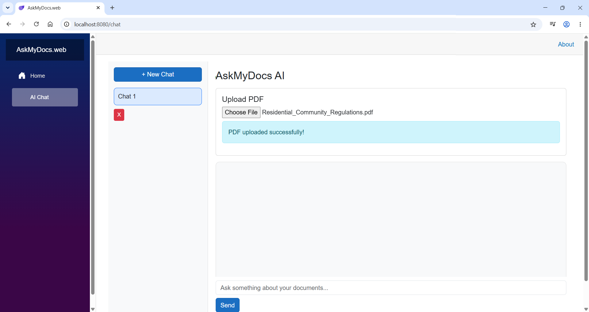
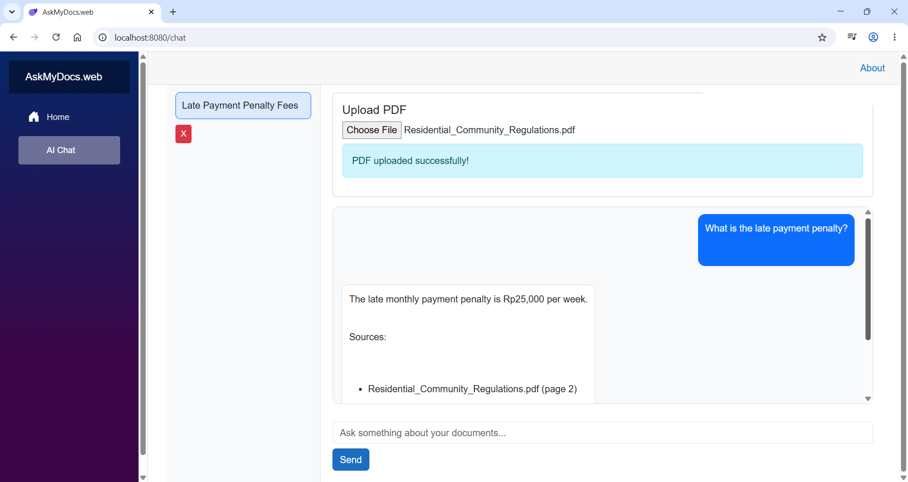
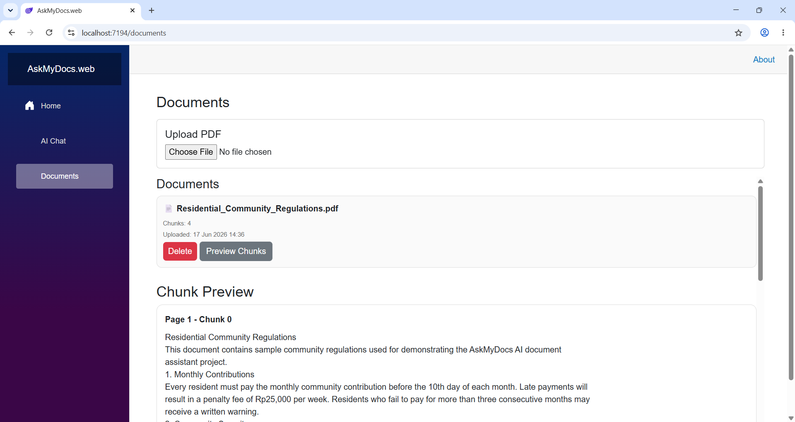

# AskMyDocs

AI-powered document assistant built with RAG (Retrieval-Augmented Generation), local embeddings, and local LLMs.

AskMyDocs allows users to upload PDF documents and ask questions about their content using semantic search and conversational AI.

---
# Screenshots

## Upload Interface


## Chat Interface


## Chunk preview Interface


---

## Diagram

```mermaid
flowchart TD

    A[Blazor WebAssembly] --> B[FastAPI Backend]

    B --> C[SentenceTransformers]
    C --> D[ChromaDB]

    B --> E[Ollama Llama 3.2]

    D --> B
    B --> E
    E --> A
```


### Architecture

* Frontend: Blazor WebAssembly + Nginx
* Backend: FastAPI + Uvicorn
* AI Model: Ollama Local LLM
* Vector Database: ChromaDB

---

## Features

* PDF Upload
* Semantic Search
* Retrieval-Augmented Generation (RAG)
* Local AI Inference
* Streaming Chat Responses
* Conversation Memory
* Source Citation
* Automatic Chat Titles
* Dockerized Deployment

---

## Docker Support

AskMyDocs is fully containerized using Docker and Docker Compose.

## Run with Docker

### Prerequisites

Install:

* Docker Desktop
* Ollama

Pull the required Ollama models:

```bash
ollama pull llama3.2
```

---

## Start the Application

```bash
docker compose up --build
```

---

## Access URLs

Frontend:

```text
http://localhost:8080
```

Backend API:

```text
http://localhost:8000
```

Swagger Docs:

```text
http://localhost:8000/docs
```

---

## Tech Stack

### Frontend

* Blazor WebAssembly
* C#
* LocalStorage

### Backend

* FastAPI
* Python
* Ollama
* ChromaDB

### AI / RAG

* Llama 3.2
* Semantic Search
* Vector Database

### DevOps

* Docker
* Docker Compose
* Nginx

---
## Sample Documents

Sample PDFs for testing are available in:

docs/sample-pdfs/

